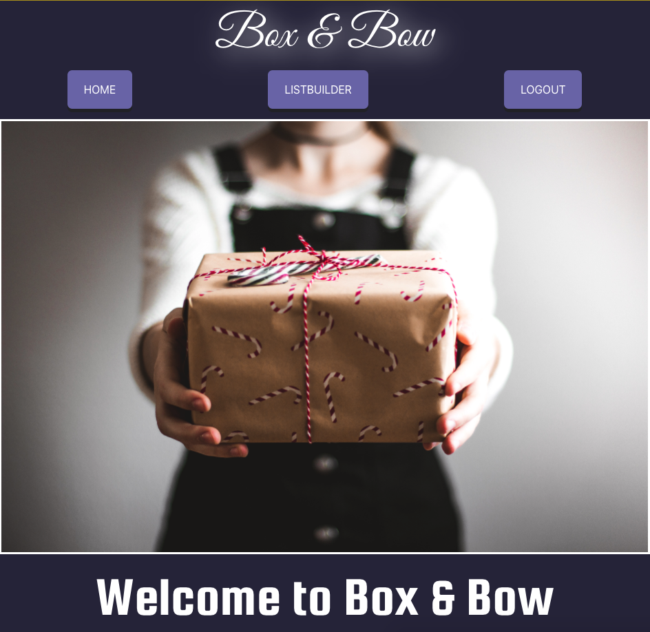
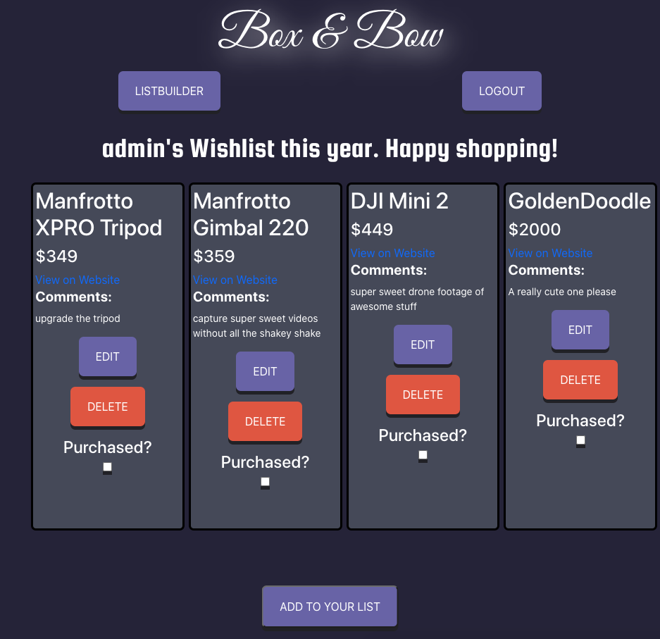

# README

Live Link: https://frosty-darwin-4987e4.netlify.app/

Box and Bow is a simple application that allows you to put your holiday shopping list in one, easy-to-use place. Track your wishlist, attach a link, add the price, and even notate the item with some comments. 

This is the home page, what you'll see when you first arrive at the application.

Once you start building a list, it will start to take shape like this. 

Feel free to make a free account and start building your list today!

# Tech used

Box & Bow front end was built using React (create-react-app). There are significant elements of CSS and HTML elements. The fonts are courtesy of Google Fonts.
